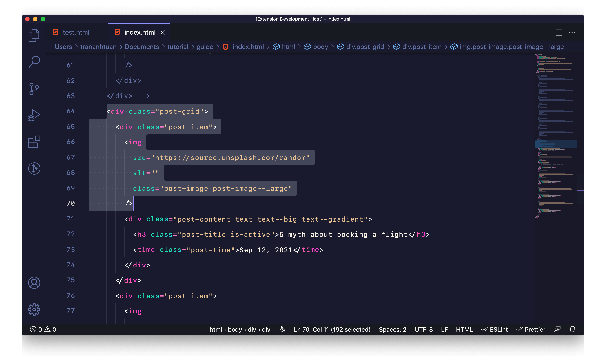
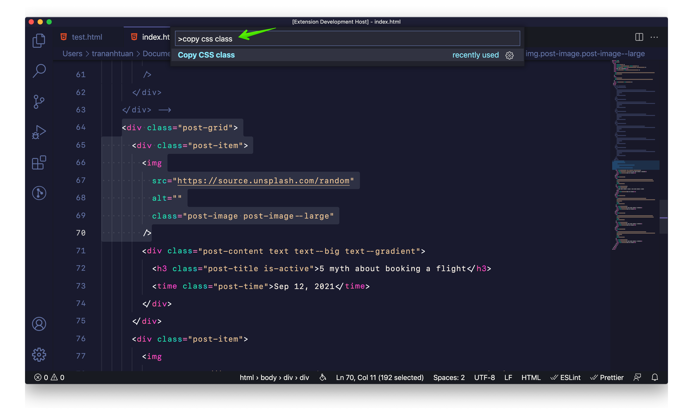
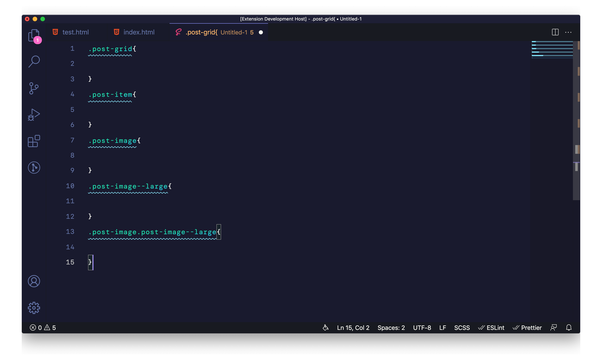
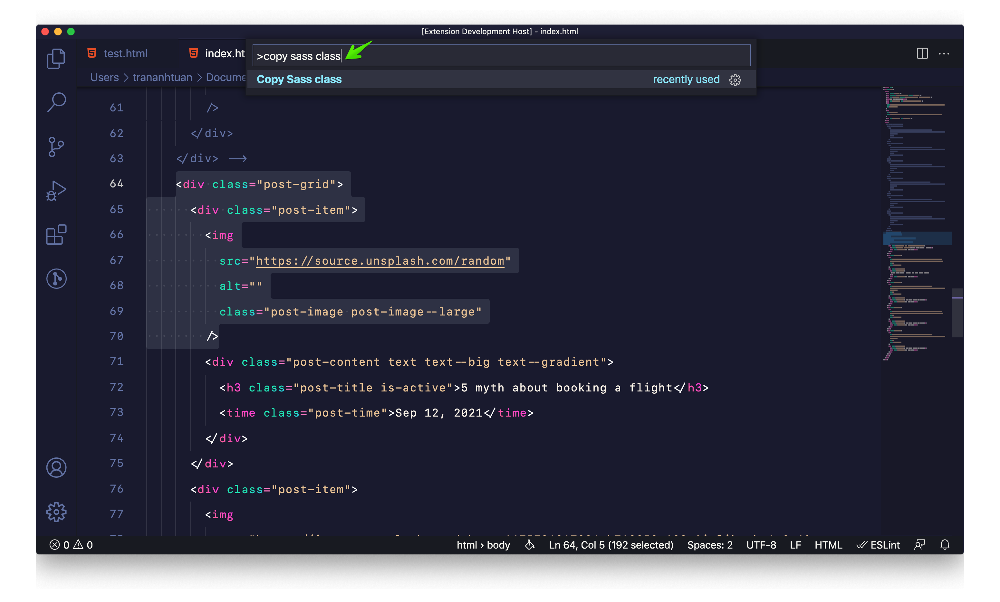
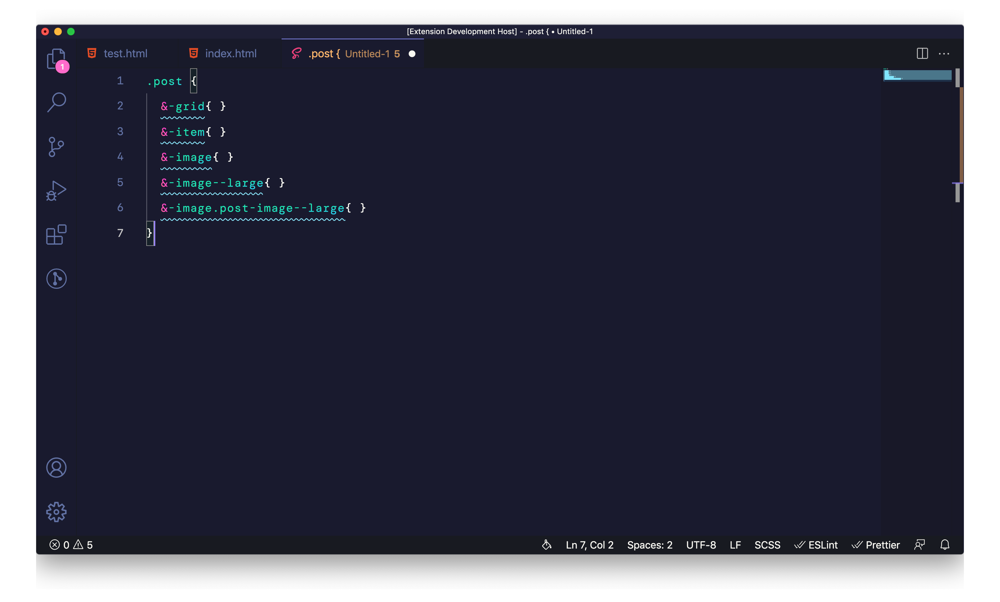

# Generate CSS class from HTML

Generate CSS, Sass class to clipboard from HTML

## Tutorial

- Select your HTML code
- `Ctrl/Command + Shift + P`
- `Copy CSS class` or `Copy Sass class` base on your coding styles
- Paste in your CSS or Sass file
- Enjoy

## Screenshots

### CSS Command

### Sass Command

## Checkout my other extensions

- [Evondev Dracula](https://marketplace.visualstudio.com/items?itemName=evondev.dracula-high-contrast&ssr=false) VScode extension.
- [Evondev Snippets](https://marketplace.visualstudio.com/items?itemName=evondev.evondev-snippets&ssr=false) VScode extension.
